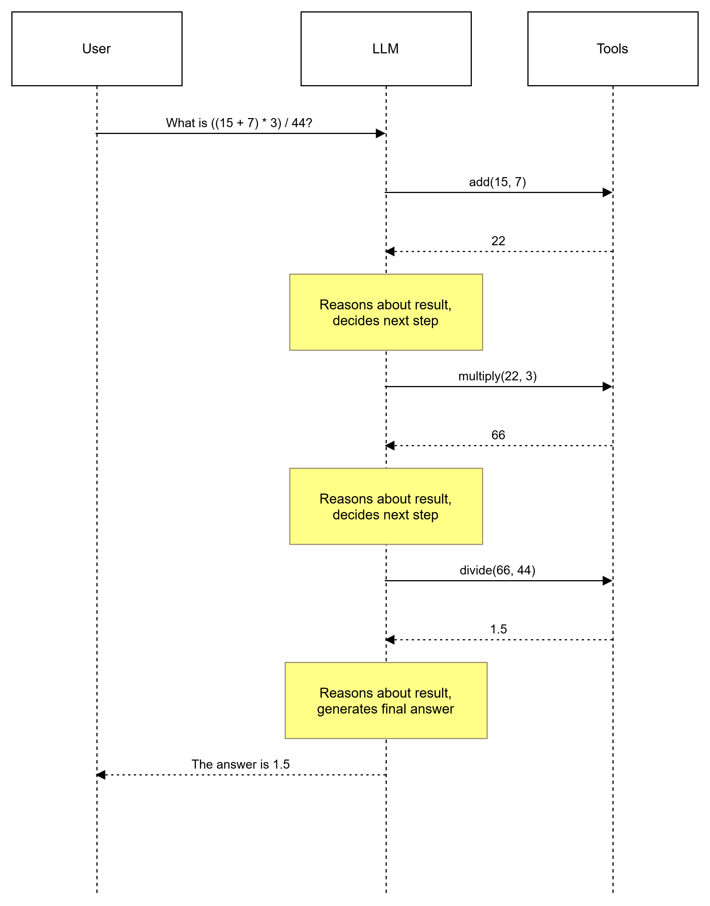
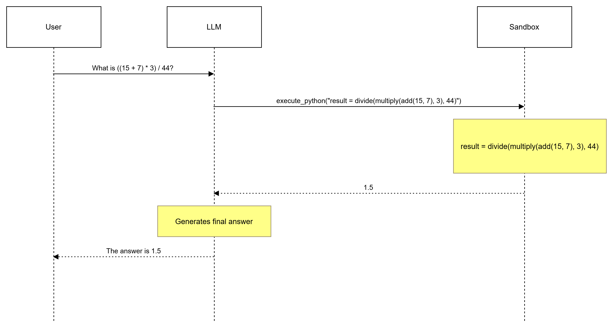

# Programmatic Tool Calling

This repo demonstrates how Programmatic Tool Calling (PTC) benefits in terms of latency and token usage compared to traditional tool calling.

## Usage

```bash
uv add openai
python3 src/main.py "What is ((15 + 7) * 3) / 44"
```

## Sample Output

```
python3 main.py "What is ((15 + 7) * 3) / 44"
==================================================
Mode: Tool Calling
==================================================
  -> Calling tool: add({"a":15,"b":7})
  -> Calling tool: multiply({"a":22,"b":3})
  -> Calling tool: divide({"a":66,"b":44})

============= STATS =============

  LLM calls:     4
  Tool calls:    3
  Input tokens:  766
  Output tokens: 74
  Total tokens:  840
  Latency:       7.39 seconds

================================

Query: What is ((15 + 7) * 3) / 44

Answer: ((15 + 7) * 3) / 44 = 1.5

==================================================
Mode: Code Execution
==================================================
  -> Calling tool: execute_python({"code":"result = divide(multiply(add(15, 7), 3), 44)"})
  -> Executing code:
result = divide(multiply(add(15, 7), 3), 44)

============= STATS =============

  LLM calls:     2
  Tool calls:    1
  Input tokens:  539
  Output tokens: 42
  Total tokens:  581
  Latency:       2.94 seconds

================================

Query: What is ((15 + 7) * 3) / 44

Answer: The result is 1.5.
```

## How Traditional Tool Calling Works

```
While final_answer_not_generated:
    1. LLM calls a tool
    2. Tool result is sent back to LLM as context
    3. LLM reasons about the tool result and either calls the next tool or generates the final answer
```





The problem is that most of the time it is not necessary for the LLM to see intermediate tool results, they can simply be passed through to the next tool call without the LLM needing to reason about them. In such cases, the intermediate results just sit in the context, causing more token usage.

## How Programmatic Tool Calling Works

In PTC, intermediate results are not shown to the LLM. Instead, the LLM only sees the final result.

```
While final_answer_not_generated:
    1. LLM generates Python code which may contain multiple steps with many intermediate results
       (e.g., filtering, math calculations, API results, web search raw results, etc.)
    2. Code is executed in a sandbox
    3. Final result is sent back to LLM
```





## Benefits

1. **Reduced token usage** — LLM doesn't see intermediate results that are not necessary for generating the final response.
2. **Reduced number of tool calls** — which in turn reduces latency and, of course, token usage.

## Limitations

This method might not be applicable in all scenarios and comes with risks of its own due to code execution if not handled properly.

Another disadvantage is that if an intermediate result is something not already anticipated by the developer building the agent with PTC, the overall response quality might be affected.

**Example:**

Suppose there are two tools: `generate_linkedin_post_content(topic)` and `post_content_to_linkedin(content)`. We integrate these with PTC and get code something like:

```python
response = generate_linkedin_post_content(topic="why python is better than java")
if response.status_code == 200:
    result = post_content_to_linkedin(content)
```

Suppose `generate_linkedin_post_content()` returns status code 200 but with content like "hateful speech not allowed" instead of returning a non-200 status code (a typical case of bad API design). The code would actually go ahead and post that to LinkedIn, which is not expected. Here it is necessary for the LLM to see the intermediate result so that it can take appropriate action.

## References

1. [Anthropic — Programmatic Tool Calling](https://platform.claude.com/docs/en/agents-and-tools/tool-use/programmatic-tool-calling)
2. [FastMCP — Code Mode](https://gofastmcp.com/servers/transforms/code-mode)